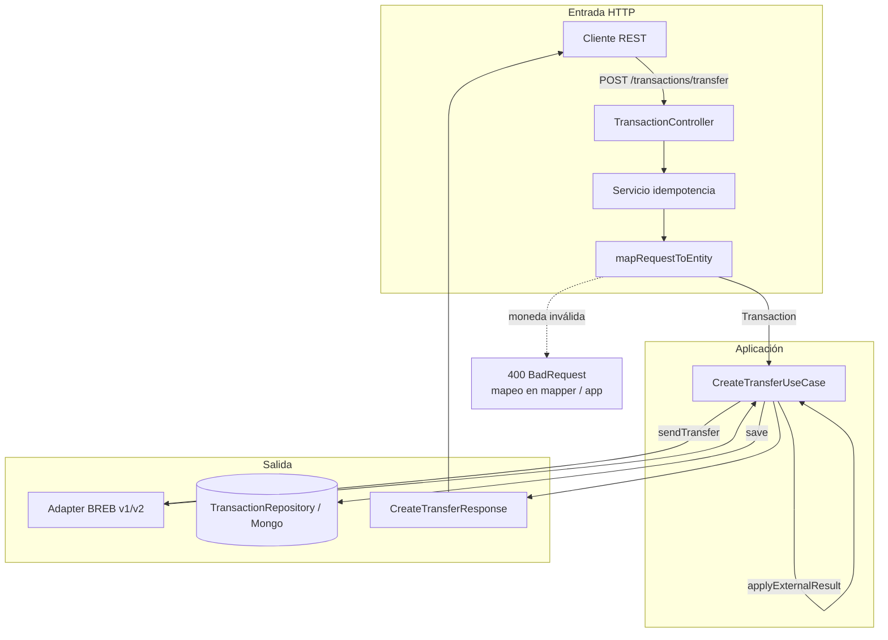
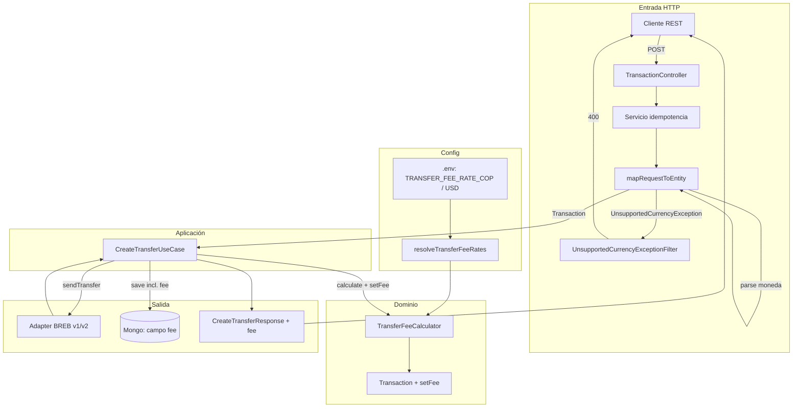
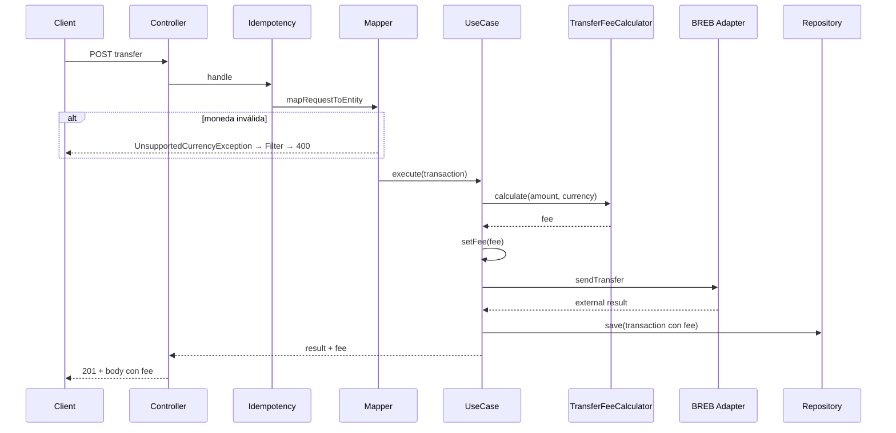

# Flujo transferencia: antes de la HDU vs con HDU (comisiones)

Vista para documentación interna. Los diagramas usan [Mermaid](https://mermaid.js.org/); se ven en preview de VS Code / Cursor o en GitHub.

### Requerimientos previos (antes del último incremento: HDU comisiones)

Lista que se entregó antes de la historia de usuario de **comisiones en transferencias**:

1. Idempotencia de transferencias  
2. Fallos del proveedor BREB  
3. Comunicación entre servicios usando HTTP/2  
4. Persistencia real de transferencias  
5. Correlation ID  
6. Métricas  
7. Versionamiento del adapter  
8. Tests reales  
9. Concurrencia  

La HDU de comisiones se apoya sobre ese contexto (p. ej. idempotencia, métricas, adapters versionados, persistencia con nuevos campos).

---

## Antes de la HDU (estado previo conceptual)

Sin cálculo de comisión, sin `fee` en entidad/respuesta/Mongo; el caso de uso iba directo a BREB tras armar la entidad.

---

### Resumen de la HDU (de qué trataba)

*(Alineado con `docs/FEATURE-fee-calculation.md`.)*

**Historia:** como sistema de transferencias, se requería que **cada operación calcule y registre su propia comisión operativa**, para que el resultado refleje el **costo aplicado según la moneda**.

**Contexto:** el costo varía por moneda; debe calcularse al procesar la transferencia, **quedar en la transacción persistida** y **verse en el resultado** de la operación.

**Criterios en síntesis:**

| # | Qué pedía la HDU |
|---|------------------|
| 1 | **COP:** comisión **1%** sobre el monto. |
| 2 | **USD:** comisión **2%** sobre el monto. |
| 3 | Otra moneda → **rechazo claro** antes de llamar al servicio externo (BREB). |
| 4 | La comisión **queda persistida** en la transacción. |
| 5 | El resultado del flujo de creación **incluye** la comisión aplicada. |
| 6 | La comisión se aplica **antes** de enviar la transferencia al proveedor externo. |

**Notas de negocio / diseño:** se usó **porcentaje** (no tarifa fija en USD) para evitar fees mayores que el monto en montos pequeños. La guía de reflexión sugería mantener la **regla de cálculo** acoplada al **dominio** (`Transaction` / calculador por moneda) y que el caso de use **orqueste**, no codifique `if (currency === 'COP')` como regla suelta.

---

## Con la HDU (estado actual)

Tasas desde **variables de entorno** → `TransferFeeCalculator` inyectado; se calcula **fee** antes de BREB, se guarda en la **entidad** y en **Mongo**, y se devuelve en la **respuesta**. Errores de moneda de dominio salen por **filtro HTTP** → 400.

---

## Secuencia resumida (con HDU)

---

## Mejoras y líneas de evolución (HDU + proyecto, visión global)

Ideas para conversación o roadmap; no son compromisos de implementación.

### Comisiones y reglas de negocio (HDU)

- **Más monedas o reglas regionales:** tasas distintas por país, producto o canal; tabla de configuración en base o servicio remoto en lugar de solo env.
- **Auditoría del fee:** quién/cuándo cambió tasas; trazabilidad para regulación (ej. entidades financieras).
- **Redondeo y precisión:** políticas explícitas por moneda (decimales, “banker’s rounding”) si operás en múltiples jurisdicciones.
- **Fee en extractos y conciliación:** exportar comisiones para contabilidad o conciliar contra el proveedor (BREB) con IDs de correlación.

### Resiliencia y operación en producción

- **Health checks** liveness/readiness (Mongo, Redis, conectividad a BREB) para orquestadores (K8s) y balanceadores.
- **Timeouts, reintentos y circuit breakers** revisados por dependencia; alertas cuando el breaker abre.
- **Colas o procesamiento asíncrono** para picos de transferencias (outbox, idempotencia ya alineada con Redis).
- **Chaos / pruebas de carga** antes de escalar a otros mercados.

### Seguridad y cumplimiento (entorno global)

- **Autenticación y autorización** de APIs (OAuth2, API keys por cliente, scopes).
- **Secrets** fuera del repo (Vault, Parameter Store, rotación).
- **Datos personales / residencia:** GDPR u otras normas según región; retención y borrado de transferencias.
- **Rate limiting y protección** (abuso, DDoS a nivel API gateway).

### Observabilidad

- **Trazas distribuidas** (OpenTelemetry) entre API, BREB y persistencia; correlación ya existe como base.
- **Métricas de negocio** (transferencias por moneda, fee acumulado, errores por tipo) y dashboards operativos.
- **Logs estructurados** y niveles por entorno; enmascarar datos sensibles en logs.

### Datos y evolución del modelo

- **Migraciones de esquema** versionadas (ej. nuevos campos, índices); estrategia para datos legacy (monedas renombradas, etc.).
- **Versionado explícito de API** (v1/v2 en path o headers) si los clientes son externos y cambian lento.

### Producto y experiencia

- **Documentación OpenAPI** publicada y alineada con validaciones (DTOs).
- **Notificaciones o webhooks** al cliente cuando cambie el estado de la transferencia.
- **Feature flags** para activar reglas nuevas por región o por cliente.

### Arquitectura y calidad de código

- **Desacoplar del framework** en la capa de aplicación (errores de dominio + filtros/globales, sin `HttpException` en casos de uso donde sea posible).
- **Contratos de prueba** con proveedores (Pact o similares) si BREB evoluciona con frecuencia.
- **CI/CD** con lint, tests, análisis estático y despliegue por entornos (dev / staging / prod).
